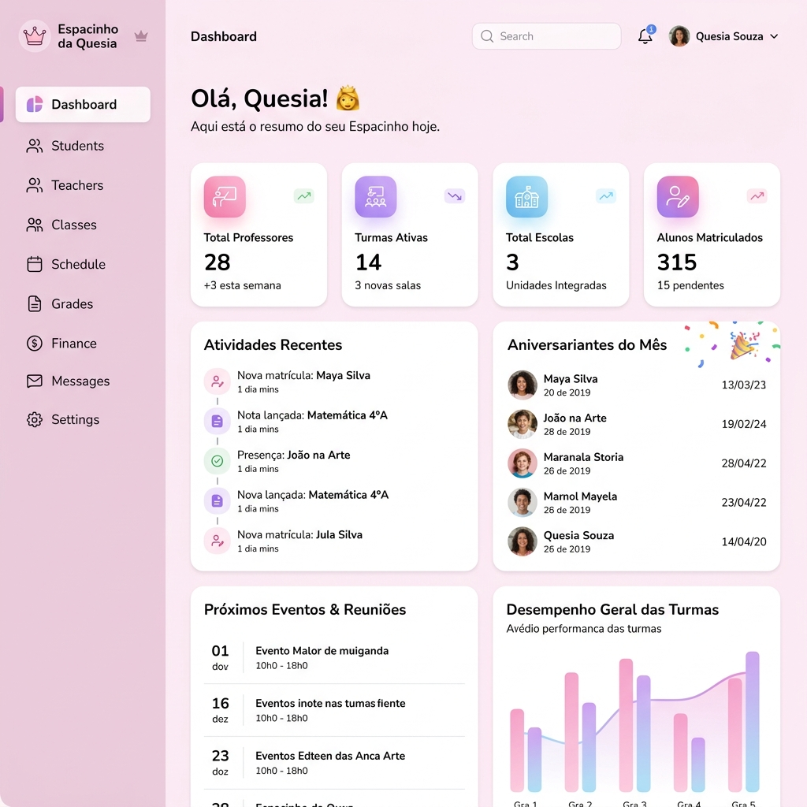
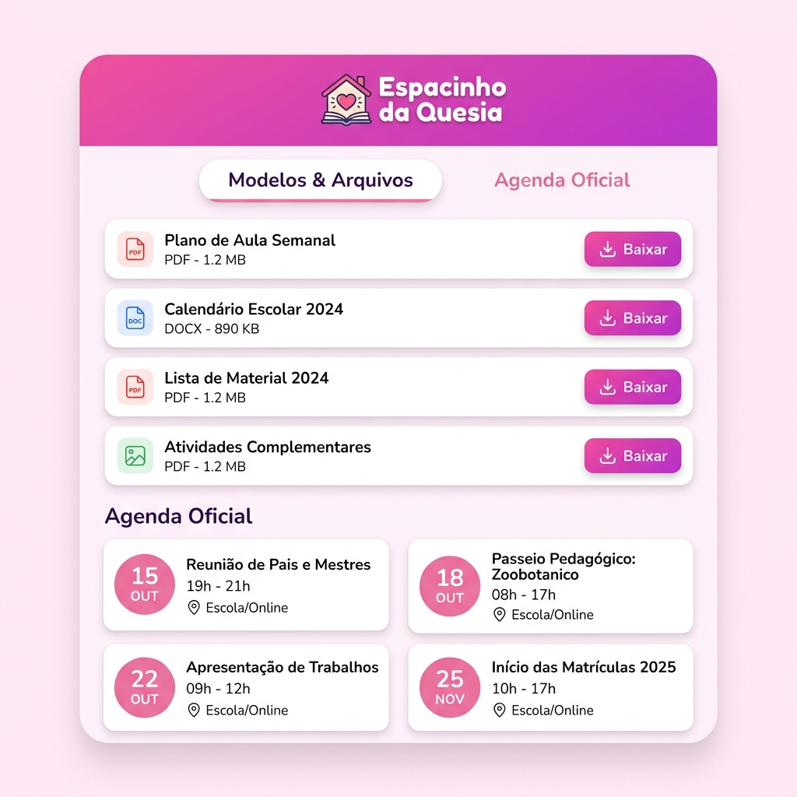

<p align="center">
  
</p>

<h1 align="center">👸 Espacinho da Quesia</h1>

<p align="center">
  <strong>Plataforma completa de gestão escolar e acompanhamento pedagógico</strong>
</p>

<p align="center">
  
  
  
  
  
</p>

<br/>

## 📋 Sobre o Projeto

O **Espacinho da Quesia** é uma plataforma web moderna desenvolvida para **coordenadoras pedagógicas** gerenciarem escolas, turmas, professores, sequências didáticas e todo o fluxo acadêmico de forma intuitiva e elegante.

A plataforma conta com um **design premium** pensado para oferecer a melhor experiência possível — com cores suaves, animações fluídas e interface responsiva para uso em qualquer dispositivo.

<br/>

## ✨ Funcionalidades

<table>
  <tr>
    <td width="50%">
      <h3>🏫 Gestão de Escolas</h3>
      <p>Cadastro completo de escolas com dados de contato, direção e endereço.</p>
    </td>
    <td width="50%">
      <h3>📚 Turmas & Disciplinas</h3>
      <p>Organização de turmas por turno e ano letivo, com disciplinas e carga horária individualizadas.</p>
    </td>
  </tr>
  <tr>
    <td>
      <h3>👩‍🏫 Professores & Vínculos</h3>
      <p>Cadastro de professores com vínculo a turmas e disciplinas específicas. Controle de aulas e frequência.</p>
    </td>
    <td>
      <h3>📖 Sequências Didáticas</h3>
      <p>Criação e acompanhamento granular de sequências com status por professor, turma e disciplina.</p>
    </td>
  </tr>
  <tr>
    <td>
      <h3>📊 Relatórios Inteligentes</h3>
      <p>Dashboards visuais com métricas de desempenho, progresso de entregas e contagem de aulas.</p>
    </td>
    <td>
      <h3>📅 Calendário Oficial</h3>
      <p>Agenda de eventos escolares integrada com gerenciamento de tarefas pessoais.</p>
    </td>
  </tr>
  <tr>
    <td>
      <h3>📁 Central de Arquivos</h3>
      <p>Repositório de documentos e modelos disponibilizados para os professores.</p>
    </td>
    <td>
      <h3>🌐 Portal Público</h3>
      <p>Página acessível sem login para professores visualizarem arquivos e agenda da escola.</p>
    </td>
  </tr>
</table>

<br/>

## 🖼️ Screenshots

<p align="center">
  
  <br/>
  <em>Tela de Login — Autenticação segura com Supabase Auth</em>
</p>

<br/>

<p align="center">
  
  <br/>
  <em>Dashboard — Visão geral com métricas, tarefas e eventos</em>
</p>

<br/>

<p align="center">
  
  <br/>
  <em>Portal Público — Acesso direto para professores (sem login)</em>
</p>

<br/>

## 🏗️ Arquitetura

```
espacinhodaquesia/
├── src/
│   ├── components/       # Componentes reutilizáveis (Sidebar, Header, Card...)
│   ├── layouts/          # MainLayout com proteção de rotas
│   ├── pages/            # 13 páginas da aplicação
│   │   ├── Dashboard.jsx
│   │   ├── Login.jsx
│   │   ├── EscolaCadastro.jsx
│   │   ├── TurmasCadastro.jsx
│   │   ├── ProfessoresCadastro.jsx
│   │   ├── ProfessoresContagem.jsx
│   │   ├── Sequencias.jsx
│   │   ├── SequenciasCadastro.jsx
│   │   ├── SequenciasAcompanhamento.jsx
│   │   ├── Calendario.jsx
│   │   ├── MinhasTarefas.jsx
│   │   ├── Arquivos.jsx
│   │   ├── Relatorios.jsx
│   │   └── PortalPublico.jsx
│   ├── store/            # Zustand store com Supabase CRUD
│   ├── lib/              # Supabase client config
│   └── context/          # (Legacy) Context API
├── docs/screenshots/     # Imagens do README
└── .env.local            # Variáveis de ambiente (não versionado)
```

<br/>

## 🛠️ Stack Tecnológica

| Camada | Tecnologia | Versão |
|--------|-----------|--------|
| **Frontend** | React | 19.x |
| **Build** | Vite | 8.x |
| **State** | Zustand | 5.x |
| **Routing** | React Router | 7.x |
| **Icons** | Lucide React | — |
| **Backend** | Supabase (PostgreSQL) | — |
| **Auth** | Supabase Auth | — |
| **Security** | Row Level Security (RLS) | — |
| **Hosting** | Vercel | — |

<br/>

## 🚀 Como Rodar Localmente

### Pré-requisitos
- **Node.js** 18+ instalado
- Conta no **[Supabase](https://supabase.com)** (projeto criado)

### Passos

```bash
# 1. Clone o repositório
git clone https://github.com/geanlogoff-spec/espacinhodaquesia.git
cd espacinhodaquesia

# 2. Instale as dependências
npm install

# 3. Configure as variáveis de ambiente
cp .env.example .env.local
# Edite .env.local com suas credenciais do Supabase

# 4. Inicie o servidor de desenvolvimento
npm run dev
```

### Variáveis de Ambiente

Crie um arquivo `.env.local` na raiz do projeto com:

```env
VITE_SUPABASE_URL=https://seu-projeto.supabase.co
VITE_SUPABASE_ANON_KEY=eyJhbGciOiJIUzI1NiIsInR5cCI6IkpXVCJ9...
```

<br/>

## 🗄️ Banco de Dados

O sistema utiliza **13 tabelas** no PostgreSQL com segurança por **Row Level Security (RLS)**:

```
profiles          → Perfil do usuário (auto-criado pelo auth trigger)
escolas           → Cadastro de escolas
turmas            → Turmas vinculadas a escolas
turma_disciplinas → Disciplinas por turma
professores       → Cadastro de professores
professor_vinculos→ Vínculo professor ↔ turma/disciplina
registro_aulas    → Contagem de aulas por vínculo
entregas          → Sequências didáticas
entrega_status    → Status por vínculo (pendente/entregue)
eventos           → Agenda de eventos da escola
tarefas           → Lista de tarefas pessoais
notas             → Bloco de notas rápidas
arquivos          → Documentos para download
```

<br/>

## 🔐 Segurança

- **Autenticação** via Supabase Auth (email/senha)
- **RLS** habilitado em todas as tabelas — cada usuário acessa apenas seus dados
- **Políticas públicas** apenas para eventos, arquivos públicos e branding
- **Auth trigger** cria perfil automaticamente no cadastro
- **Sessão persistente** — refresh da página não desloga

<br/>

## 🎨 Design System

O Espacinho utiliza um design system coeso com variáveis CSS:

| Token | Cor | Uso |
|-------|-----|-----|
| `--primary-pink` |  `#f4a6c8` | Ações primárias, botões |
| `--primary-purple` |  `#c3b0f5` | Destaques, sequências |
| `--primary-blue` |  `#9adbf6` | Informações, badges |
| `--bg-color` |  `#fcf4f9` | Background geral |
| `--success-green` |  `#6bc27b` | Status positivo |
| `--danger-red` |  `#ea7a8b` | Alertas, exclusão |

- **Font:** [Nunito](https://fonts.google.com/specimen/Nunito) (800 weight)
- **Border Radius:** 24px (cards), 9999px (botões/pills)
- **Animations:** fadeIn, slideInUp, scaleIn com stagger

<br/>

## 📄 Licença

Este projeto é de uso privado e pertenece à coordenação do **Espacinho da Quesia**.

<br/>

---

<p align="center">
  Feito com 💖 para o <strong>Espacinho da Quesia</strong> 👸
</p>
